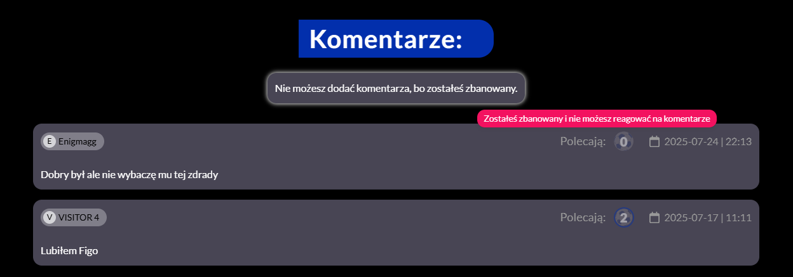
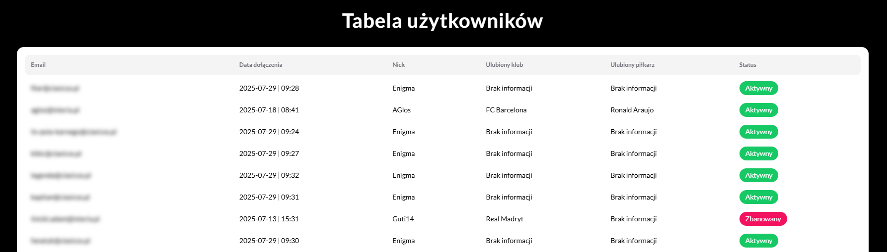
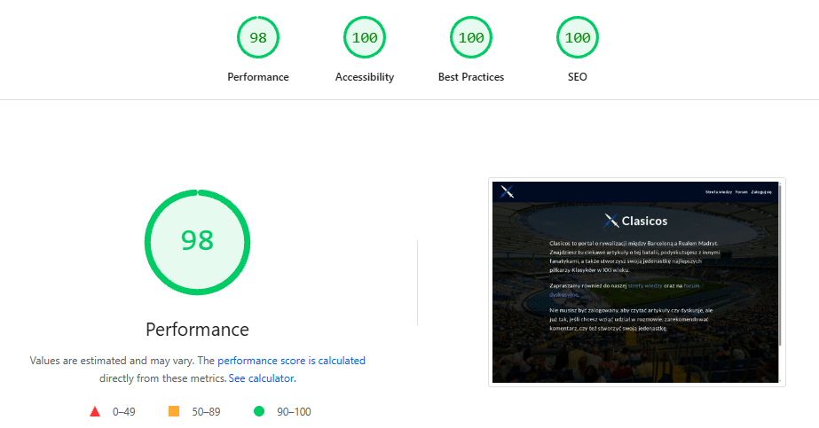

# Clasicos

I am a developer with commercial experience who built **Clasicos** as a side project using NestJS and Next.js - https://clasicos.pl.

## What is Clasicos?

Clasicos is a full‑stack web application and neutral gathering place for Polish fans of both FC Barcelona and Real Madrid. Built with NestJS and Next.js, it offers a rich set of features:

- **Create Your Team**  
  Choose the all‑time top eleven players of Barcelona and Real Madrid in the 21st century, drawn from my extensive player database.

- **Player Suggestions**  
  If a favourite player isn’t yet listed, submit a quick suggestion form and the admin will review and add them.

- **Two User Roles**  
  - **Visitors:** Can build teams, comment, recommend other users' comments, and update their profile information.  
  - **Admins:** Can ban users (which prevents them from commenting and recommending), delete inappropriate comments, add new players, and manage suggestions.

- **Managed Relational Database**  
  Player data, user submissions, comments, and recommendations are stored in a hosted MySQL database.

- **Secure Authentication**  
  Users' passwords are handled by Firebase Authentication - they are not stored directly in my database.

- **Custom Domain & DNS**  
  The entire app runs under [clasicos.pl](https://clasicos.pl), with custom DNS records pointing to my frontend and API hosts.

- **Issue Reporting Form**  
  Found a bug or have feedback? Use the built‑in “Report a Problem” form to let me know instantly.

- **Mobile‑First & Responsive**  
  Fully optimized for smartphones and tablets, so you can manage your XI on the go.

- **Image Optimization & Performance**  
  All images in Clasicos are optimized and converted to WebP, and served via Next.js’s built-in `Image` component to maximize performance and loading speed on all devices. The site achieves a 98/100 performance, 100/100 accessibility, 100/100 best practices, and 100/100 SEO score on Google PageSpeed     Insights.

## Tech Stack & Design

- **Design (Figma)**: A big thanks to [@njqnik](https://github.com/njqnik) - thanks to the polished Figma design I could fully focus on frontend, backend, and deployment.  
- **Backend**: NestJS (https://github.com/AdamIlnicki24/clasicos-api)  
- **Frontend**: Next.js (https://github.com/AdamIlnicki24/clasicos-web)  

Each repo has its own detailed README - feel free to check them out!

## Why This Idea?

I’ve spent 17 years on similar fan sites and watched them evolve rapidly. Rather than build yet another club-specific fan page, I wanted to create a truly neutral space where Polish fans of both Barcelona and Real Madrid could gather.  

The most popular Polish Barcelona and Real Madrid sites have active forums with high posting frequency. Clasicos offers the same - users can post comments and recommend others’ comments. Offensive behavior is policed by admins, who can ban users to keep the community welcoming.

## Branching & Deployment

- **Development**: Most of the work happens on the `dev` branch.
- **Main**: Pull requests from `dev` are merged into `main`.
- **Refactor**: short‑lived branch for minor fixes or experiments; merged into `dev` and then deleted.
- **Deployment**: `main` is connected to Vercel for automatic CI deployments.

## TODOs

- [ ] Implement pagination to support a growing number of comments  
- [ ] Add functionality for users to reply to a specific comment 

 

Below, I’ve included screenshots of screens that a logged-in, non-banned Visitor user (the default experience after registration and login) will not see in the application. <ins>Click on any image to enlarge it.</ins>
  
## Example view of a banned user:

## Example view of an admin:

## PageSpeed Insights score:

